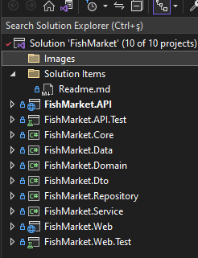

# FishMarket Uygulamasý

FishMarket, bir .NET Core API ve .NET Core MVC projelerini içeren bir uygulamadýr. Bu uygulama, balýk pazarý iþlemlerini simüle eder ve API üzerinden veri saðlar. 

## Kurulum

1. Bu projenin kaynak kodlarýný almak için aþaðýdaki komutu kullanarak GitHub deposunu klonlayýn:
    ```
    git clone https://github.com/mehmetyagci/FishMarket.git
    ```

2. Ardýndan, klonladýðýnýz dizine geçin:
    ```
    cd FishMarket
    ```

3. FishMarket.sln solution dosyasýný Visual Studio veya baþka bir geliþtirme ortamýnda açýn.

4. API projesi, SQL Server veritabaný kullanmaktadýr. Veritabanýnýn oluþturulmasý ve iliþkilendirilmesi gerekmektedir. Bunun için, API projesinin `appsettings.json` dosyasýnda veritabaný baðlantý bilgilerini ayarlayýn ve ardýndan veritabanýný Code First Migration kullanarak oluþturun. Bu adýmý gerçekleþtirmek için aþaðýdaki komutlarý sýrasýyla kullanabilirsiniz:
    ```
    dotnet ef migrations add InitialCreate
    dotnet ef database update
    ```

5. FishMarket.API ve FishMarket.MVC projelerini Startup project olarak belirleyin ve Visual Studio'da çalýþtýrýn.

6. API ve MVC projelerini baþlatýn ve FishMarket uygulamasýný kullanmaya baþlayýn.

## Mimari

FishMarket uygulamasý, Onion mimarisi kullanýlarak tasarlanmýþtýr. Katmanlar, birbirinden olabildiðince baðýmsýz olarak geliþtirilmiþtir ve aþaðýdaki gibi sýralanmýþtýr:

- **Domain**: Sadece Domain Entity 'leri burada tanýmlanýr.  
- **Data**: DbContext ve veritabaný schema tanýmlarý burada bulunur.
- **Core**: Uygulamanýn genel yapýlandýrma ve temel hizmetleri bu katmanda yer alýr. Baðýmlýlýklarý yönetir ve uygulama boyunca kullanýlan çekirdek iþlevleri saðlar.
- **Repository**: Veritabaný ile iletiþimi yöneten katmandýr. Veri tabaný iþlemleri bu katman aracýlýðýyla gerçekleþtirilir.
- **Service**: Uygulamanýn iþ mantýðýný uygulayan hizmetlerin bulunduðu katmandýr. API katmanýndan gelen istekleri iþler ve tüm iþ mantýðý burada yürütülür.
- **API**: Service katmanýnda yazýlan tüm süreçlerin kullanýlabilmesini saðlayan servisler saðlar. 
- **MVC**: Web Katmaný, API katmanýna Http istekleri yaparak merkezi olarak 
- **DTO**: Veri transfer nesnelerinin (DTO'larýn) tanýmlandýðý katmandýr. Veri tabanýndan alýnan veya API'den döndürülen verilerin taþýnmasýnda kullanýlýr. MVC uygulamasý da ayný DTO 'larý kullanýr.
 


## Kullanýlan Kütüphaneler

FishMarket uygulamasýnda aþaðýdaki kütüphaneler kullanýlmýþtýr:

- **EntityFrameworkCore**: .NET Core uygulamalarý için ORM (Object-Relational Mapping) kütüphanesidir. Veritabaný iþlemlerini yönetmek için kullanýlýr.
- **Automapper**: Nesneler arasýnda veri eþleme iþlemlerini kolaylaþtýrmak için kullanýlan bir kütüphanedir.
- **FluentValidation**: Giriþ validasyonlarýný yapmak için kullanýlan bir kütüphanedir. 
- **xUnit**: .NET uygulamalarý için bir test çerçevesidir. Birim testlerin yazýlmasý ve çalýþtýrýlmasý için kullanýlýr.
- **log4Net**: .NET uygulamalarýnda günlük dosyalarýný yönetmek ve olaylarý kaydetmek için kullanýlan bir günlükleme kütüphanesidir.
- **MailKit**: .NET uygulamalarý için e-posta gönderme iþlemlerini yönetmek için kullanýlan bir kütüphanedir.
- **JWT token ile authentication**: JSON Web Token (JWT) kullanarak kimlik doðrulama ve yetkilendirme iþlemlerini saðlamak için kullanýlan bir kütüphanedir.

## Uygulamanýn Kullanýmý

FishMarket uygulamasý, temel olarak iki modülden oluþmaktadýr: API ve Web.

- **API Modülü**: Fish ve User servislerini içerir. API modülündeki tüm Fish servisleri için kimlik doðrulamasý gereklidir. Bu servisler, kullanýcýlarýn balýk iþlemlerini yönetmelerine olanak tanýr. User servisleri için ise kimlik doðrulamasý gerekli deðildir.  

- **Web Modülü**: Kullanýcý arayüzünü saðlar ve API üzerinden FishMarket uygulamasýna eriþim saðlar. Web modülü, kullanýcýlarýn uygulamayý kullanarak balýk pazarý iþlemlerini gerçekleþtirmelerini saðlar. Kimlik doðrulamasý, kullanýcý giriþi için kullanýlýr ve Fish servislerine eriþim saðlamak için gereklidir.


